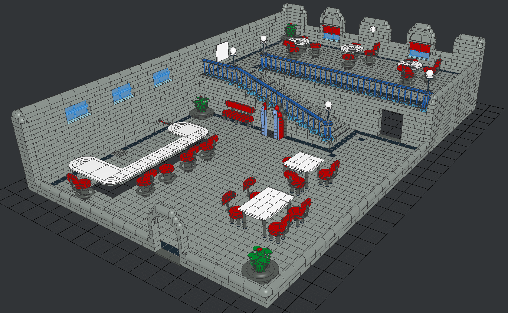

This is a LEGO set depicting the Chez Luc scene from the LBA2 game (Little Big Adventure 2: Twinsen's Odyssey).

This model in released to the public domain. Feel free to do whatever you want. The file can be opened and edited using LeoCAD (https://github.com/leozide/leocad/)

You're not required to do so, but I would appreciate to get photos of the model if you actually build it with real LEGO bricks ;-)

As a reference, this is what the scene looks like in the game:

