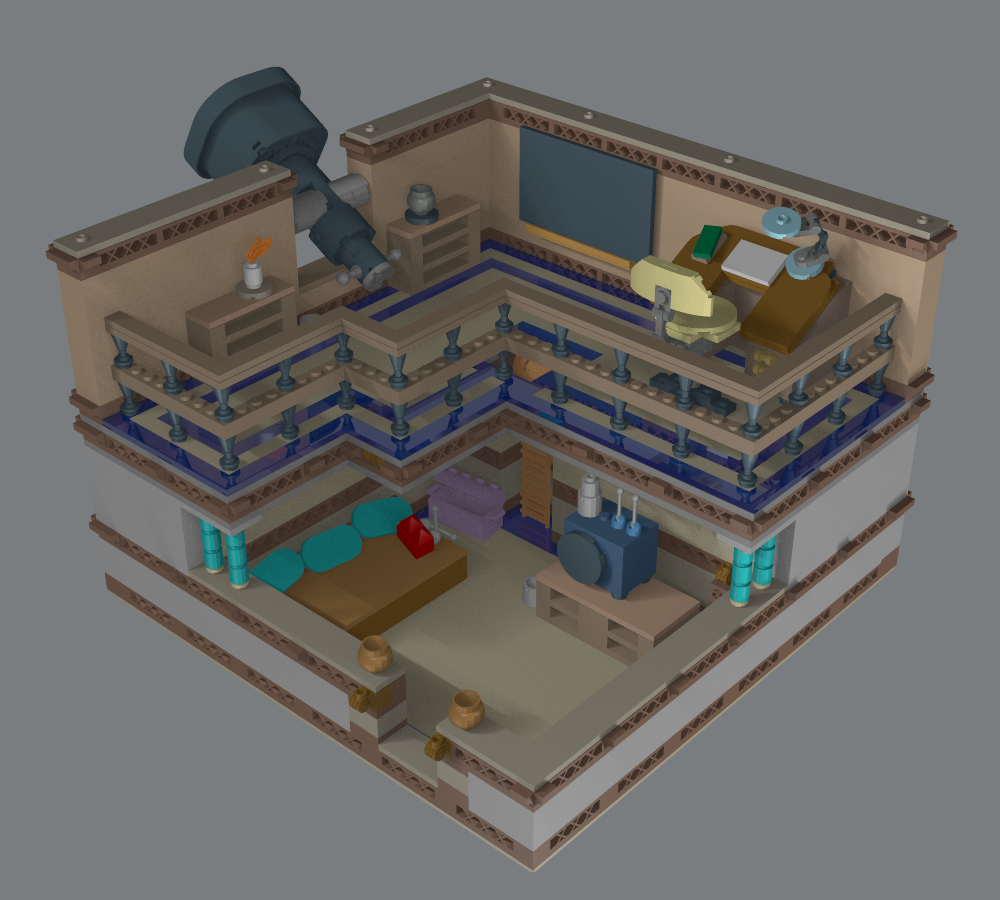
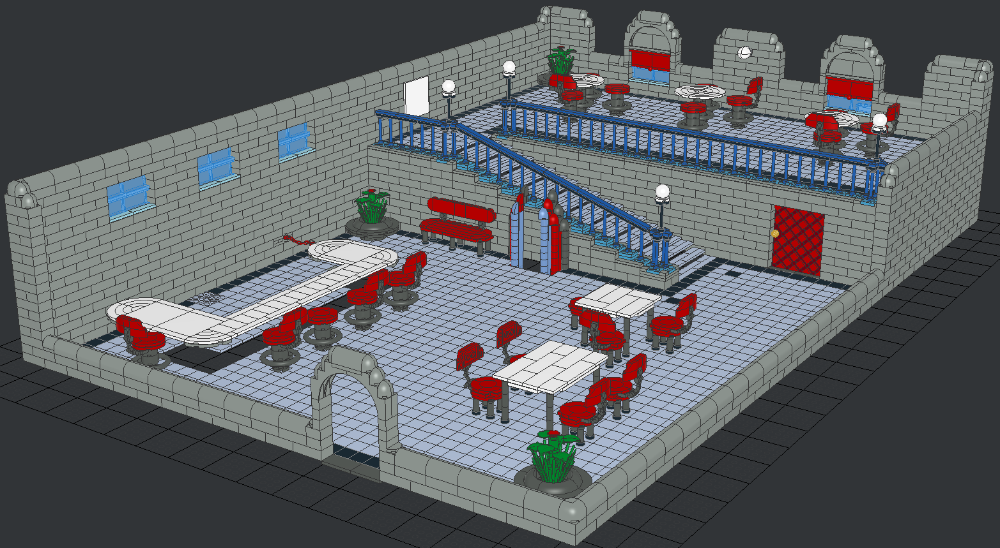
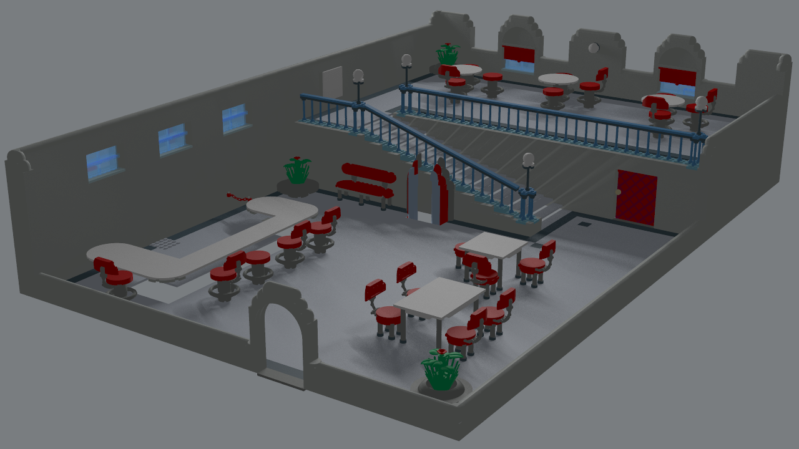

This repo contains models of LEGO sets depicting scenes from the LBA2 game (Little Big Adventure 2: Twinsen's Odyssey).

The models are released to the public domain. Feel free to do whatever you want. The files can be opened and edited using LeoCAD (https://github.com/leozide/leocad/)

You're not required to do so, but I would appreciate to get photos of the models if you actually build any of them with real LEGO bricks ;-)

## Baldino's House

## Chez Luc

As a reference, this is what this scene looked like in the original game:

